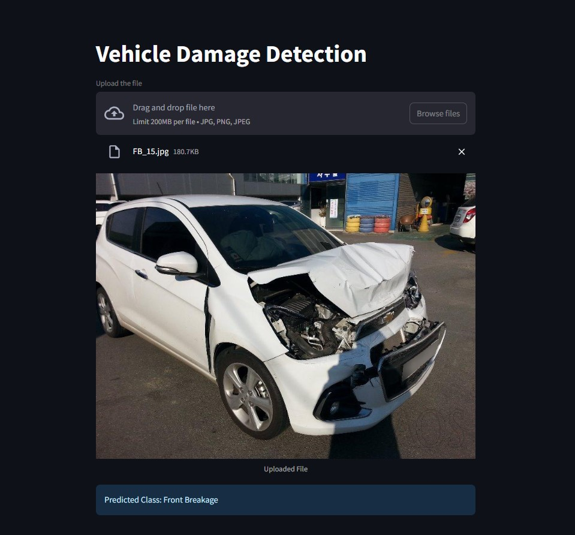

# Vehicle Damage Detection

A Streamlit-based web application that detects damage in vehicle images using a machine learning model.

---

## 🔍 Features

- Upload car images to detect damage areas
- Lightweight ML model integration
- Intuitive web UI using Streamlit
- Works in real-time with images
- Easy to run locally

---

## 🖼 Demo Screenshot

> *Make sure the image file app_screenshot.jpg is in the root of your repo or update the path.*

---

## 🧰 Tech Stack

- *Python*
- *Streamlit*
- * PyTorch*
- *OpenCV*
- *scikit-learn*

---
